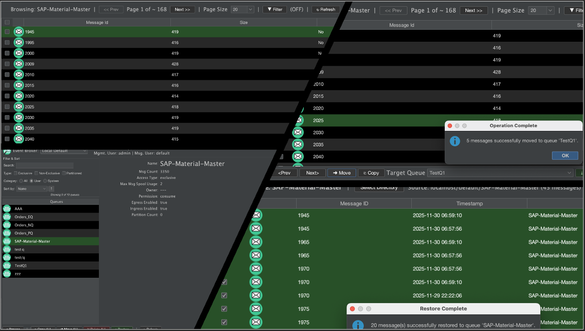

# SolaceQueueBrowserGui 2.0
v2.6.0 - Apr 15, 2026

Desktop GUI for browsing Solace Queues and managing messages.



## Overview

[SolaceQueueBrowserGui](https://github.com/SolaceServices/SolaceQueueBrowserGui) is a desktop application that provides a comprehensive interface for browsing, inspecting, and managing messages in Solace queues. 

**SolaceQueueBrowserGui-v2.0** (this fork) adds enhanced UI, several additional features and fixes.

Please see **[User Guide](./docs/USER_GUIDE.md)** under docs for detailed information and instructions.

### Key Features

- **Multi-broker support** - Connect to and switch between multiple Solace brokers dynamically

- **Queue management** - View, search, filter, and sort queues with real-time updates
  - Search queues by name (case-insensitive)
  - Filter by queue type (Exclusive, Non-Exclusive, Partitioned, Last Value Queue)
  - Filter by category (User, System, All)
  - Sort by name, spool size, spool usage, or usage percentage
  - View topic subscriptions for selected queues (configurable display limit)
- **Message browsing** - Paginated message browser with detailed inspection
  - View message headers, user properties, and payload
  - Payload format selection (Plain, JSON, YAML, CSV)
  - Text wrapping for long payloads
  - Page navigation with configurable page size
- **Message operations** - Comprehensive message management
  - **Move** - Move messages between queues (removes from source)
  - **Copy** - Copy messages to another queue (keeps in source)
  - **Delete** - Delete messages from queues
  - **Download** - Download messages to ZIP files for offline analysis
  - **Restore** - Restore previously downloaded messages back to queues
  - Bulk operations support (select multiple messages)
- **Filtering** - Filter messages by multiple criteria
  - Filter by message headers (Destination, TTL, Delivery Mode, etc.)
  - Filter by user properties
  - Filter by payload content (contains/does not contain)
  - Combine multiple filter conditions
- **Password encryption** - Secure password storage with AES-256-GCM encryption
  - Encrypt passwords in configuration files
  - Master password prompt or command-line option
  - Backward compatible with plain text passwords
- **Cross-platform** - Runs on Windows, macOS, Linux, and WSL
- **Multiple profile support** - Switch between UI profiles (Clean, Dark, Modern, default) for customized appearance and better cross platform support.

## Quick Start

### Prerequisites

- Java Runtime Environment (JRE) 17 or higher
- Network access to Solace broker SEMP API endpoint
- Network access to Solace broker messaging endpoint
- Appropriate credentials (SEMP admin and messaging client)

### Running the Application

1. **Extract the distribution package** (if you haven't already):
   ```bash
   unzip SolaceQueueBrowserGui-VERSION-runtime-distribution.zip
   cd SolaceQueueBrowserGui-VERSION/
   ```

2. **Create your broker configuration file**:
   - Copy `config/sample-config-plain.json` (or `config/sample-config-encrypted.json`) to `config/default.json`
   - Edit `config/default.json` with your specific broker connection details
   - See `config/sample-config-plain.json` for plain text password example
   - See `config/sample-config-encrypted.json` for encrypted password example

3. **Run the application**:
   ```bash
   ./scripts/run.sh -c config/default.json
   ```

For detailed instructions, see the [User Guide](./docs/USER_GUIDE.md).

## Configuration

The application uses JSON configuration files to connect to Solace brokers. Configuration requires:

- **Broker connection details** - SEMP host, messaging host, VPN name, and credentials
- **System configuration** - UI profiles, fonts, colors, and other system settings

**Quick setup:**
1. Copy `config/sample-config-plain.json` (or `config/sample-config-encrypted.json`) to `config/default.json`
2. Edit `config/default.json` with your broker connection details

**Note:** The application requires both SEMP admin credentials (for queue management) and messaging client credentials (for message browsing).

For detailed configuration instructions, file formats, and examples, see the [Configuration section](./docs/USER_GUIDE.md#configuration) in the User Guide.

## Password Encryption

The application supports AES-256-GCM encryption for passwords stored in configuration files. This allows secure storage of credentials in version control or shared configuration files.

- Encrypt passwords using the `crypt-util.sh` utility
- Encrypted passwords use the format: `ENC:AES256GCM:...`
- Master password can be provided via GUI prompt or command-line option

For detailed instructions on encrypting passwords, command-line options, and security considerations, see the [Password Encryption section](./docs/USER_GUIDE.md#password-encryption) in the User Guide.

## Message Operations

The application provides comprehensive message management capabilities:

- **Browse** - Inspect messages with paginated navigation and detailed views
- **Move** - Transfer messages between queues (removes from source)
- **Copy** - Duplicate messages to another queue (keeps in source)
- **Delete** - Remove messages from queues
- **Download** - Save messages to ZIP files for offline analysis
- **Restore** - Republish previously downloaded messages back to queues

Operations support single message or bulk selection. Messages can be filtered by headers, properties, and payload content before operations.

For detailed instructions on performing operations, file formats, and workflow, see the [Operations section](./docs/USER_GUIDE.md#operations) in the User Guide.

## Features in Detail

### Queue Management
Real-time search, filtering by type and category, and sorting capabilities help you quickly find and manage queues across multiple brokers.

### Message Browser
Paginated message browser with configurable page size, detailed message inspection, and support for multiple payload formats (Plain, JSON, YAML, CSV).

### Message Filtering
Filter messages by headers, user properties, and payload content. Multiple filter conditions can be combined for precise message selection.

### Bulk Operations
Select and operate on multiple messages simultaneously with confirmation dialogs and automatic selection management.

For detailed feature descriptions, usage instructions, and examples, see the [User Guide](./docs/USER_GUIDE.md).

## Package Contents

- **Application JAR** - Self-contained executable with all dependencies
- **Configuration files** - System config, logging config, sample config templates (`sample-config-plain.json`, `sample-config-encrypted.json`, `solace-cloud.json`), and icons
- **Runtime scripts** - `run.sh` (application launcher) and `crypt-util.sh` (password encryption utility)
- **Documentation** - This README and comprehensive User Guide in `docs/` folder

**Note:** Create your own `config/default.json` by copying `config/sample-config-plain.json` (or `config/sample-config-encrypted.json`) and updating it with your broker connection details.

## Documentation

- **[User Guide](./docs/USER_GUIDE.md)** - Complete user guide and reference manual with detailed instructions, configuration examples, command-line options, troubleshooting, and more

## Disclaimer

**This tool is NOT a Solace supported product.** It has been created by Solace's professional services team to augment Solace products.

## Contributors
- This Repo (fork) is mainained by [Ramesh Natarajan](mailto:ramesh.natarajan@solace.com)
- Original repo owner is [Mike Obrien](mailto:mike.obrien@solace.com)
