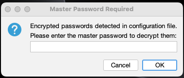
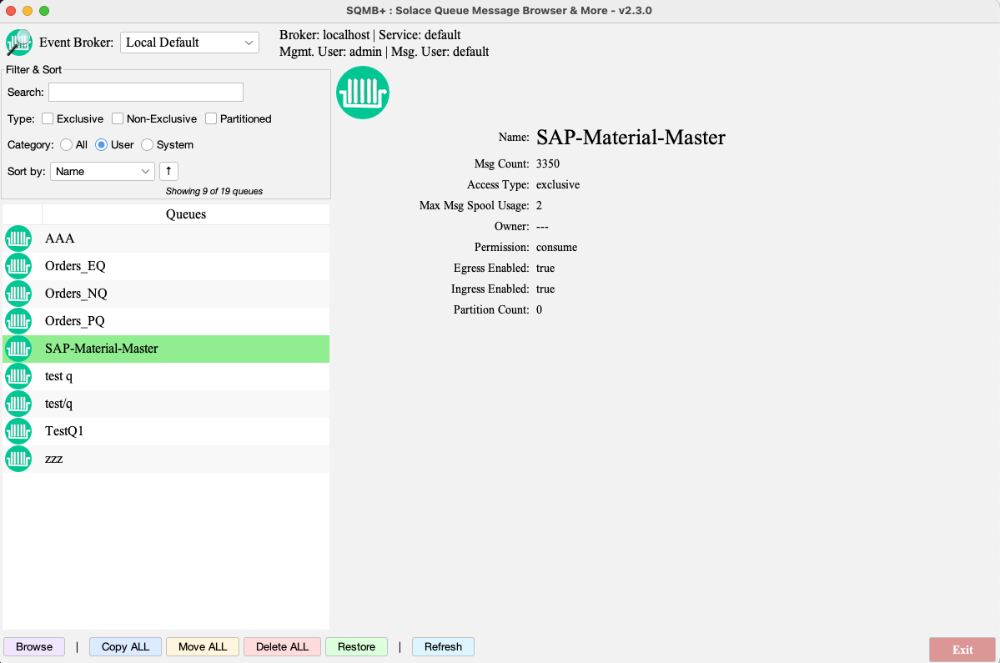
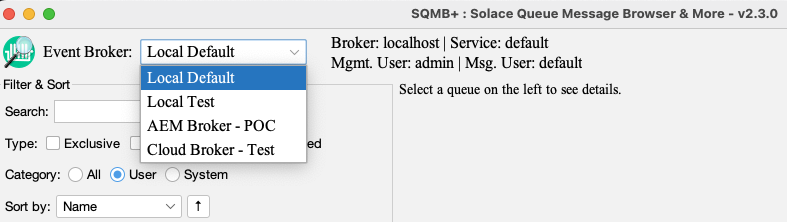
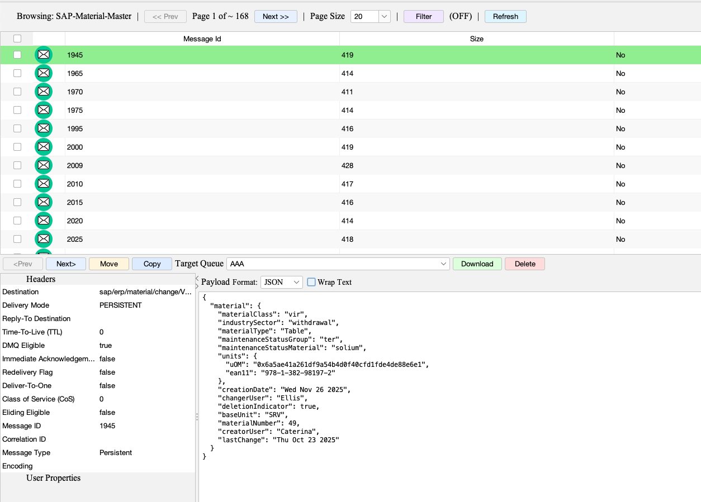
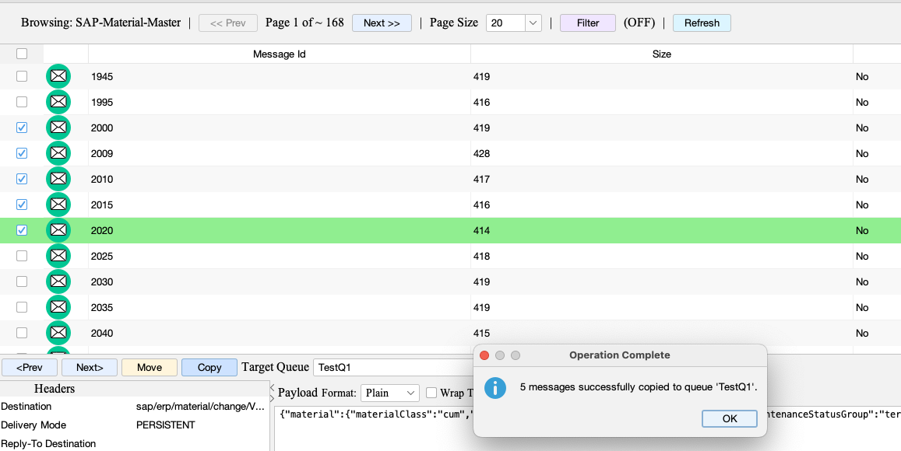
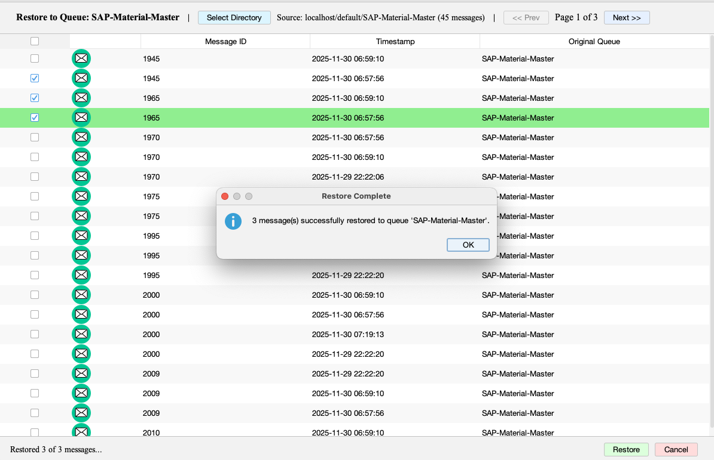
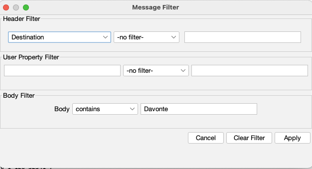
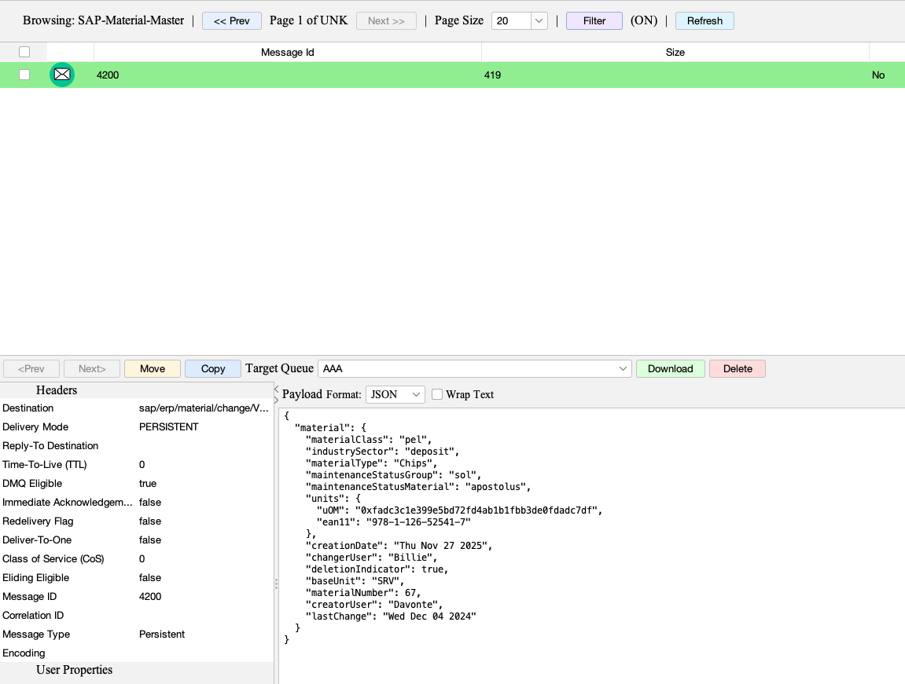

# SolaceQueueBrowserGui 2.0 - User Guide and Reference Manual
v2.4.2 - Dec 01, 2025

## Table of Contents

1. [Introduction](#introduction)
2. [Installation and Setup](#installation-and-setup)
3. [Configuration](#configuration)
4. [Main Window](#main-window)
5. [Message Browser](#message-browser)
6. [Operations](#operations)
7. [Filtering and Sorting](#filtering-and-sorting)
8. [Password Encryption](#password-encryption)
9. [Troubleshooting](#troubleshooting)
10. [Reference](#reference)

---

## Introduction

SolaceQueueBrowserGui 2.0 is a desktop GUI application for browsing, inspecting, and managing messages in Solace queues. The application provides a comprehensive interface for message operations including viewing, filtering, moving, copying, deleting, and downloading messages.

**Note:** This guide is written for users who have extracted the runtime distribution package. If you are building from source, refer to the main README.md for build instructions.

### Key Features

- Multi-broker support with dynamic switching
- Queue filtering and sorting capabilities
- Message filtering by headers, properties, and payload content
- Bulk message operations (move, copy, delete)
- Message download functionality
- Password encryption support
- Cross-platform compatibility (Windows, macOS, Linux, WSL)
- Multiple UI Profile support including Dark profile.

### System Requirements

- Java Runtime Environment (JRE) 8 or higher
- Network access to Solace broker SEMP API endpoint
- Network access to Solace broker messaging endpoint
- Appropriate credentials (SEMP admin and messaging client)

---

## Installation and Setup

### Extracting the Distribution Package

1. Extract the distribution package:
   ```bash
   unzip SolaceQueueBrowserGui-VERSION-runtime-distribution.zip
   cd SolaceQueueBrowserGui-VERSION/
   ```

   Or for TAR.GZ format:
   ```bash
   tar -xzf SolaceQueueBrowserGui-VERSION-runtime-distribution.tar.gz
   cd SolaceQueueBrowserGui-VERSION/
   ```

2. Verify the package contents:
   ```
   SolaceQueueBrowserGui-VERSION/
   ├── SolaceQueueBrowserGui-VERSION-jar-with-dependencies.jar  # Application JAR
   ├── config/                                                   # Configuration files
   │   ├── system.json                                          # System configuration (required)
   │   ├── log4j2.properties                                    # Logging configuration
   │   ├── sample-config.json                                   # Sample user configuration template
   │   ├── solace-cloud.json                                    # Sample Solace Cloud configuration
   │   └── *.png                                                # Application icons
   ├── scripts/                                                  # Runtime scripts
   │   ├── run.sh                                               # Main application launcher
   │   └── crypt-util.sh                                        # Password encryption/decryption utility
   ├── docs/                                                     # Documentation
   │   ├── USER_GUIDE.md                                        # Complete user guide (this file)
   │   └── img/                                                  # Documentation images
   ├── downloads/                                                # Downloads directory (empty)
   ├── logs/                                                     # Logs directory (empty)
   └── README.md                                                 # Project overview and quick start
   ```

### Running the Application

**Before running, create your configuration file:**
1. Copy `config/sample-config.json` to `config/default.json`
2. Edit `config/default.json` with your specific broker connection details

#### Using the Run Script (Recommended)

```bash
./scripts/run.sh -c config/default.json
```

The run script automatically detects the JAR file location and works in the distribution package environment. If the config file uses encrypted password, the master password used can be supplied on the command line.

```bash
./scripts/run.sh -c config/default.json --master-password "MASTER_PASSWORD"
```
Otherwise, the tool will prompt for it.


#### Using Java Directly

```bash
java -jar SolaceQueueBrowserGui-VERSION-jar-with-dependencies.jar -c config/default.json
```

#### Command-Line Options

- `-c, --config FILE`: Specify configuration file path (required)
- `-mp, --master-password PWD`: Provide master password for encrypted passwords (optional)
- `-up, --ui-profile PROFILE`: Override UI profile (Clean, Modern, Dark) (optional)
- `-h, --help`: Display help information

``` bash
./scripts/run.sh -c config/default.json --master-password "MASTER-PASSWORD" --ui-profile Dark
==================================================
Starting SolaceQueueBrowserGui
==================================================
📄 Using provided config: config/default.json
🚀 Starting application...
   JAR: SolaceQueueBrowserGui-v2.3.0-jar-with-dependencies.jar
   Config: config/default.json
   Master Password: [provided]
   UI Profile: Dark


**Note:** Replace `config/default.json` with your own configuration file name if you created a custom one.

=================================================================
Starting Solace Queue Browser - Version: v2.3.0
=================================================================
```

---
## Password Encryption

### Overview

The application supports AES-256-GCM encryption for passwords stored in configuration files. Encrypted passwords can be safely stored in version control or shared configuration files.

### Encryption Format

Encrypted passwords use the format:
```
ENC:AES256GCM:{base64_encrypted_data}:{base64_iv}:{base64_salt}
```

### Encrypting Passwords

#### Using the CLI Tool

**Interactive Mode**:
```bash
./scripts/crypt-util.sh encrypt
```

**Non-Interactive Mode**:
```bash
./scripts/crypt-util.sh encrypt "password" "masterKey"
```

```bash
./scripts/crypt-util.sh encrypt encrpyt-this my-master-password
ENC:AES256GCM:TmU+U1nssQa2mKRXbbPgT+tgOvtq3blaRz92wA==:SJdIJ1phOWwkep5o:B+ZT8WAvp7GC1KmX8fpAww=
```

### Updating Configuration File

Replace plain text passwords with encrypted values:

```json
{
  "eventBrokers": [{
    "sempAdminPw": "ENC:AES256GCM:U2FsdGVkX1+...",
    "messagingPw": "ENC:AES256GCM:glqBL0OCe+13V/62Zx3is7vNhtQ3ug0=..."
  }]
}
```

### Running with Encrypted Passwords

#### GUI Prompt (Recommended)

When the application detects encrypted passwords, it prompts for the master password:

1. Launch application
2. Master password dialog appears
3. Enter master password
4. Application decrypts passwords and connects



#### Command-Line Master Password

```bash
./scripts/run.sh -c config/default.json --master-password "masterKey"
```

**Note:** Ensure you have created `config/default.json` by copying and editing `config/sample-config.json` with your broker details.

**Note**: Quote the master password if it contains special characters (e.g., `#`, `$`, `!`).

### Decrypting Passwords (Verification)

To verify an encrypted password:

```bash
./scripts/crypt-util.sh decrypt "ENC:AES256GCM:..." "masterKey"
```

### Security Considerations

- Master password is never stored in configuration files
- Encrypted passwords can be safely stored in version control
- Each encryption uses unique salt and IV for security
- Master password must be provided at runtime
---

## Configuration

### Configuration File Structure

The application uses a two-file configuration system:
1. **User Configuration** - Contains user configs such as Solace broker access info.
2. **System Configuration** (`config/system.json`) - Contains system and internal properties. This file should not be updated.

The system configuration is loaded first, followed by the user configuration file. 

#### System Configuration File (`config/system.json`)

**WARNING**: DONOT rename or modify this file. 

The system configuration file supports UI profiles for platform-optimized and theme-based configurations. See the [UI Profiles](#ui-profiles) section for detailed information about profiles.

**Profile-Based Configuration (Current)**:

The file now includes a `profiles` section with Clean, Modern, and Dark profiles. Each profile can have:
- `buttonTextIcons`: Boolean to enable/disable Unicode icons in buttons
- `font`: Font configuration (family, sizes, etc.)
- `colors`: Color configuration (table rows, buttons, etc.)

**Legacy Single Configuration (Backward Compatible)**:

The file may also include legacy `font` and `colors` sections at the top level for backward compatibility.

**Error Handling:**
- If `config/system.json` doesn't exist, the application exits with: "Failed to read system configuration file 'config/system.json': [error]. The system.json file is required."
- If the file contains invalid JSON, the application exits with: "Failed to parse system configuration file 'config/system.json': [error]. The system.json file must be valid JSON."
- If processing the file fails, the application exits with: "Failed to process system configuration file 'config/system.json': [error]"


#### User Configuration File Format

**Getting Started:**
1. Copy `config/sample-config.json` to `config/default.json`
2. Edit `config/default.json` with your specific broker connection details (hostnames, credentials, VPN names, etc.)
3. The `sample-config.json` file is provided as a reference template only

User configuration files contain broker connection information. This file supports multiple broker connections in a list. 

```json
{
  "eventBrokers": [
    {
      "name": "Broker Display Name",
      "sempHost": "http://localhost:8080/SEMP/v2/config",
      "sempAdminUser": "admin",
      "sempAdminPw": "password",
      "msgVpnName": "default",
      "messagingHost": "tcp://localhost:55333",
      "messagingClientUsername": "default",
      "messagingPw": "password"
    }
  ]
}
```

**Error Handling:**
- If the user config file doesn't exist or can't be read, the application exits with: "Failed to read user configuration file: [error]"
- If the file contains invalid JSON, the application exits with: "Failed to parse user configuration file: [error]"
- If the file doesn't contain `eventBrokers` array, the application exits with: "User configuration must contain 'eventBrokers' array"
- If processing the configuration fails, the application exits with: "Failed to process user configuration: [error]"
- If processing `eventBrokers` fails, the application exits with: "Failed to process eventBrokers configuration: [error]"


**Broker Configuration (`eventBrokers` array):**

- `name`: Display name for the broker (shown in broker selector dropdown)
- `sempHost`: SEMP v2 API endpoint URL (supports http://, https://)
- `sempAdminUser`: SEMP API administrator username
- `sempAdminPw`: SEMP API administrator password (supports encrypted format with ENC:string)
- `msgVpnName`: Message VPN name
- `messagingHost`: Messaging endpoint URL (supports tcp://, tcps://)
- `messagingClientUsername`: Messaging client username
- `messagingPw`: Messaging client password (supports encrypted format with ENC:)


See `../config/sample-config.json` for a sample configuration file with multiple broker entries. Copy this file to `config/default.json` and update it with your specific broker connection details.

---

## Main Window

The main window provides the primary interface for queue selection and message operations.



### Window Components

#### Header Panel

The header panel displays broker connection information and controls:

- **Broker Selector**: Dropdown menu for switching between configured brokers
- **Connection Information**: Displays current broker hostname, VPN name, SEMP user, and messaging client user
- **Application Icon**: SolaceQueueBrowserGui 2.0 logo



#### Queue Filter and Sort Panel

Located below the header, this panel provides queue filtering and sorting capabilities:

- **Search Field**: Real-time text search for queue names (case-insensitive substring matching)
- **Queue Type Filters**: Checkboxes for Exclusive, Non-Exclusive, Partitioned, Last Value Queue
- **Category Filters**: Radio buttons for All, User (default), System queues
- **Sort Options**: Dropdown for sort criteria (Name, Spool Size, Spool Usage, Spool Usage %)
- **Sort Direction**: Button to toggle ascending/descending order
- **Queue Count**: Label showing "Showing X of Y queues"


#### Queue Table

Displays filtered and sorted queues with the following columns:

- **Queues**: Queue name
- **Messages**: Current message count
- **Spool Size**: Allocated spool size (maxMsgSpoolUsage)
- **Spool Usage**: Current spool usage (msgSpoolUsage)
- **Spool Usage %**: Percentage of spool used

#### Queue Details Panel

Located on the right side, displays detailed information for the selected queue:

- Queue name
- Message count
- Spool usage details
- Access type
- Partition information (if applicable)


#### Action Buttons

Located at the bottom of the window:

- **Browse**: Open message browser for selected queue
- **Copy ALL**: Copy all messages from selected queue to target queue
- **Move ALL**: Move all messages from selected queue to target queue
- **Delete ALL**: Delete all messages from selected queue
- **Restore**: Restore messages from downloaded ZIP files to selected queue
- **Refresh**: Refresh queue list and details
- **Exit**: Close application


### Queue Selection

- **Single Click**: Selects a queue and displays details in the details panel
- **Double Click**: Opens the message browser for the selected queue
- **Keyboard Navigation**: Arrow keys navigate through the queue list

### Broker Switching

When multiple brokers are configured:

1. Select broker from dropdown in header panel
2. Application automatically reconnects to selected broker
3. Queue list refreshes with queues from new broker
4. Connection information updates to reflect new broker

#### Queue Type Filters


- **Exclusive**: Queues with `accessType = "exclusive"`
- **Non-Exclusive**: Queues with `accessType = "non-exclusive"`
- **Partitioned**: Queues with `partitionCount > 0`
- **Last Value Queue**: Queues with `maxMsgSpoolUsage == 0`

**Behavior**:
- Multiple types can be selected (OR logic)
- Queues matching any selected type are shown
- Works in combination with search and category filters

#### Category Filters

- **All**: Shows all queues (user and system)
- **User**: Shows only user queues (names not starting with "#")
- **System**: Shows only system queues (names starting with "#")

**Default**: User queues (system queues hidden by default)


### Queue Sorting

#### Sort Options

- **Name**: Alphabetical order (case-insensitive)
- **Spool Size**: By allocated spool size (`maxMsgSpoolUsage`)
- **Spool Usage**: By current spool usage (`msgSpoolUsage`)
- **Spool Usage %**: By usage percentage (`msgSpoolUsage / maxMsgSpoolUsage`)

#### Sort Direction

- Toggle button switches between ascending and descending
- Visual indicator shows current direction (↑ or ↓)


---

## Message Browser

The message browser window opens when browsing a queue. It provides detailed message inspection and management capabilities.



### Window Components

#### Top Control Panel

- **Queue Name**: Displays current queue being browsed
- **Page Navigation**: Previous Page and Next Page buttons
- **Page Information**: Shows current page number and total pages (e.g., "Page 1 of ~ 10")
- **Page Size**: Dropdown to select messages per page (default: 20)
- **Filter Status**: Shows filter status as "(ON)" or "(OFF)"
- **Filter Button**: Opens filter dialog
- **Refresh Button**: Reloads current page

#### Message Table

Displays messages for the current page with columns:

- **Checkbox**: Select individual messages for bulk operations
- **Message ID**: Unique message identifier
- **Timestamp**: Message timestamp
- **Destination**: Message destination topic or queue
- **Size**: Message size in bytes

#### Select-All Checkbox

Located in the top-left corner of the message table (intersection of row and column headers):

- **Checked**: All messages on current page are selected
- **Unchecked**: No messages are selected
- Automatically updates based on individual checkbox selections

#### Message Details Panels

Located below the message table, split into three sections:

**Headers Panel:**
- Displays message header fields (Destination, Delivery Mode, TTL, etc.)
- Read-only display of message metadata

**User Properties Panel:**
- Displays user-defined properties
- Key-value pairs in table format

**Payload Panel:**
- Displays message payload content
- Format selection dropdown: Plain, JSON, YAML, CSV
- Wrap text checkbox for long lines
- Monospaced font for better readability

### Message Selection

- **Individual Selection**: Click checkbox in first column
- **Select All**: Click select-all checkbox in top-left corner or click column header
- **Keyboard Navigation**: Arrow keys navigate through messages
- **Row Selection**: Clicking a row selects the message and displays details

### Page Navigation

- **Previous Page**: Navigate to previous page of messages
- **Next Page**: Navigate to next page of messages
- **Page Size**: Change number of messages per page (dropdown in top panel)
- **Page Count**: Displays estimated total pages based on message count and page size

The Next button is automatically disabled when:
- No more messages are available (unfiltered view)
- All filtered messages have been displayed (filtered view)
- Current page has fewer messages than page size (indicates end of results)

---

## Operations

### Browse Messages

**Purpose**: Open message browser to inspect messages in a queue.

**Steps**:
1. Select a queue from the queue table
2. Click "Browse" button or double-click the queue name
3. Message browser window opens displaying first page of messages

### Move/Copy/Delete Messages

**Purpose**: Move selected messages from current queue to another queue. The flow is the same for Copy and Delete operations.

**Single Message**:
1. Select message in message table
2. Select target queue from dropdown
3. Click "Move" button
4. Confirm operation in dialog

**Multiple Messages**:
1. Select messages using checkboxes
2. Select target queue from dropdown
3. Click "Move" button
4. Confirm operation in dialog

**Bulk Operation (All Messages)**:
1. In main window, select source queue
2. Select target queue from dropdown
3. Click "Move ALL" button
4. Confirm operation in dialog



**Behavior**:
- Messages are removed from source queue on move and delete, but retained on Copy
- Messages are added to target queue
- Confirmation dialog shows number of messages moved
- Page count recalculates after deletion
- If no checkboxes are selected, the currently focused row is used
- If no row is focused, operation is cancelled with status message

### Download Messages

**Purpose**: Download selected messages to a ZIP file for offline analysis.

**Steps**:
1. Select one or more messages using checkboxes
2. Click "Download" button
3. Messages are saved to ZIP file in configured download folder
4. Confirmation dialog shows download location and count

**File Format**:
- ZIP file path: `./downloads/{hostname}/{vpn-name}/{queue-name}/msg-{MessageID}-{YYYYMMDDHHSS}.zip`
- Directory structure organized by broker hostname, VPN name, and queue name
- Queue names and VPN names sanitized (replaces "/" and spaces with "_")
- Timestamp format: `YYYYMMDDHHSS` (e.g., `20240115143025`)
- Each message saved as individual ZIP file containing payload, headers, and user properties
- Original message format preserved

**Behavior**:
- Messages remain in source queue (not removed)

```bash
ls -l downloads/localhost/default/SAP-Material-Master | head -4
-rw-r--r--@ 1 rameshnatarajan  staff  895 Nov 30 06:57 msg-1945-20251130065756.zip
-rw-r--r--@ 1 rameshnatarajan  staff  895 Nov 30 06:59 msg-1945-20251130065910.zip
-rw-r--r--@ 1 rameshnatarajan  staff  893 Nov 30 06:57 msg-1965-20251130065756.zip
```
### Restore Messages

**Purpose**: Restore previously downloaded messages from ZIP files back to a Solace queue.

**Steps**:
1.  Select a queue in the main window (this will be the target queue for restoration)
2. Click "Restore" button
3. Click "Select Directory" button and Navigate to directory containing downloaded message ZIP files (typically `./downloads/{hostname}/{vpn-name}/{queue-name}/`)
4. Messages from the directory are displayed in a paginated table
5. Select messages to restore using checkboxes (or use select-all checkbox in header)
6. Click "Restore" button
7. If source and target differ (different broker/VPN/queue), confirm the mismatch in dialog
8. Messages are restored to the target queue
9. Confirmation dialog shows number of messages restored



**File Format**:
- Restore dialog reads from configured `downloadFolder` (default: `./downloads`)
- Expected directory structure: `{downloadFolder}/{hostname}/{vpn-name}/{queue-name}/`
- ZIP file naming: `msg-{MessageID}-{YYYYMMDDHHSS}.zip`
- Each ZIP file contains: `payload.txt`, `headers.txt`, `userProps.txt`


**Behavior**:
- Messages are published to target queue using JCSMP API
- Message headers and user properties are preserved
- Original message format is maintained


---

## Filtering and Sorting

### Queue Filtering

#### Search Filter

- **Location**: Search field in filter panel
- **Function**: Case-insensitive substring matching on queue names
- **Behavior**: Updates in real-time as you type
- **Combines With**: All other filters (AND logic)


### Message Filtering

#### Filter Dialog

Opens when clicking "Filter" button in message browser.


#### Filter Criteria

**Header Filter**:
- **Field**: Select header field (Destination, Delivery Mode, TTL, etc.)
- **Condition**: Equals, Contains, Does not contain
- **Value**: Filter value (text, number, or picklist selection)

**User Property Filter**:
- **Property Name**: User-defined property name
- **Condition**: Equals, Contains, Does not contain
- **Value**: Property value to match

**Payload Filter**:
- **Condition**: Contains, Does not contain
- **Value**: Text to search in message payload



#### Filter Behavior

- All criteria are combined with AND logic
- Filter applies to all pages (not just current page)
- Page count adjusts when filter is active
- Filter status shown as "(ON)" or "(OFF)" in top panel
- Clearing filter resets to show all messages



#### Clearing Filters

- Click "Filter" button to open dialog
- Set all conditions to "-no filter-"
- Click "Apply" to clear filters


---


---

## Troubleshooting

### Connection Issues

#### SEMP Connection Failures

**Solutions**:
- Verify SEMP host URL is correct and accessible
- Check SEMP admin credentials
- Verify network connectivity to broker
- Check firewall rules for SEMP port (typically 8080 for HTTP, 943 for HTTPS)


#### SMF (Messaging) Connection Failures

**Symptoms**:
- Message browser opens but shows no messages
- Error dialog shows SMF connection failure

**Solutions**:
- Verify messaging host URL is correct
- Check messaging client credentials
- Verify VPN name matches configuration
- Check network connectivity to messaging endpoint
- Verify firewall rules for messaging port (typically 55555 for TCP, 55443 for TCPS)

### Password Decryption Errors

**Symptoms**:
- Error dialog: "Failed to decrypt password" or "Wrong master password"

**Solutions**:
- Verify master password is correct
- Ensure master password matches the one used for encryption
- Check for special characters that may need quoting in command line
- Use GUI prompt instead of command-line password if issues persist

### Message Loading Issues

**Symptoms**:
- Messages do not appear in browser
- Empty message table

**Solutions**:
- Check queue has messages (verify in main window)
- Verify SMF connection is successful
- Check filter settings (may be filtering out all messages)
- Try refreshing the page
- Check application logs in `logs/browser.log`

### UI Display Issues

**Symptoms**:
- Text clipped or not displaying
- Fonts not rendering correctly
- Profile not found error

**Solutions**:
- Check UI configuration in config file
- Verify font family is available on your system
- Set `fontFamily` to `null` to use system defaults
- Check log files for font-related errors
- Verify profile name is correct (case-sensitive: "Clean", "Modern", "Dark")
- If using command-line override, ensure profile exists in `profiles` section
- Check that `profiles` section exists in `config/system.json` if using profile-based config


### Performance Issues

**Symptoms**:
- Slow queue list loading
- Slow message browsing

**Solutions**:
- Reduce page size for message browsing
- Use queue filters to limit displayed queues
- Check network latency to broker
- For large queue counts, filtering helps reduce UI load

---

## UI Profiles

The application supports multiple UI profiles for different platforms and themes. Profiles allow you to customize fonts, colors, button icons, and other UI elements to match your platform or preference. The application uses **FlatLaf** (Flat Look and Feel) as the underlying UI framework, with FlatLightLaf for light themes and FlatDarkLaf for the Dark profile.

### Available Profiles

1. **Clean** - Clean and minimal design
   - Button text icons: **Disabled**
   - Use this profile if you are having display issues

2. **Modern** - Modern design with Unicode icons (default)
   - Button text icons: **Enabled**
   - Uses FlatLightLaf (light theme)
   - Switch to *Clean* if Unicode icons won't display

3. **Dark** - Dark theme using FlatDarkLaf
   - Button text icons: **Enabled**
   - Automatically switches to FlatDarkLaf (dark theme) 

### Selecting a Profile

#### Method 1: Configuration File

Edit `config/system.json` and set the `"profile"` field in the `"ui"` section:

```json
{
  "ui": {
    "profile": "Dark"
  }
}
```

Valid values: `"Clean"`, `"Modern"`, `"Dark"`, or `"auto"` (defaults to "Modern").

#### Method 2: Command-Line Override

Use the `--ui-profile` (or `-up`) command-line option to override the config file setting:

```bash
./scripts/run.sh -c config/default.json --ui-profile Dark
```

**Priority**: Command-line override > Config file setting > Default ("Modern")

### Profile Features

- **Button Text Icons**: Modern and Dark profiles include Unicode icons in buttons (⌕ Browse, ⎘ Copy, ➜ Move, ✕ Delete, ↻ Refresh, ▼ Filter, ⤓ Download, ⎌ Restore, ⊗ Exit). Clean profile has icons disabled.
- **Theme Integration**: Clean and Modern profiles use FlatLightLaf (light theme). Dark profile automatically uses FlatDarkLaf (dark theme).
- **Table Row Colors**: Light themes use white and grey alternating rows. Dark theme uses black and dark grey alternating rows.

### Profile Selection Behavior

- **Profile exists**: Loads font, color, and icon settings from the selected profile
- **Profile not found**: Shows error message listing available profiles
- **No profiles section**: Falls back to legacy single config format (if `font`/`colors` sections exist)
- **No UI config**: Uses default values
- **Dark profile**: Automatically switches to FlatDarkLaf theme
- **Other profiles**: Use FlatLightLaf theme

### Switching Profiles

You can switch profiles in two ways:

#### Method 1: Edit Configuration File

1. Open `config/system.json`
2. Find the `"ui"` section
3. Change the `"profile"` value to `"Clean"`, `"Modern"`, or `"Dark"`
4. Save the file
5. Restart the application

Example:
```json
{
  "ui": {
    "profile": "Dark"
  }
}
```

#### Method 2: Command-Line Override

Use the `--ui-profile` option to override the config file setting without editing:

```bash
./scripts/run.sh -c config/default.json --ui-profile Dark
```

**Priority Order**:
1. Command-line override (`--ui-profile`) - highest priority
2. Config file setting (`"profile"` in system.json)
3. Default profile ("Modern")

**Note**: Command-line override takes precedence over config file settings. Use this to test different profiles without modifying the configuration file.

### Backward Compatibility

Existing installations using the legacy single-config format continue to work:
- If `profiles` section doesn't exist, uses `font`/`colors` sections
- Legacy configs use FlatLightLaf by default

---

## Reference

### Configuration File Schema

#### System Configuration Schema (`config/system.json`)

**Profile-Based Configuration (Recommended)**:

```json
{
  "version": "string (optional, default: v2.1.3)",
  "downloadFolder": "string (optional, default: ./downloads)",
  "ui": {
    "profile": "string (optional: 'Clean', 'Modern', 'Dark', or 'auto', default: 'Modern')",
    "profiles": {
      "Clean": {
        "description": "string (optional)",
        "buttonTextIcons": "boolean (optional, default: false)",
        "font": {
          "fontFamily": "string | null (optional)",
          "defaultFontFamilyFallback": "string (optional)",
          "defaultFontSize": "integer (optional)",
          "headerFontSize": "integer (optional)",
          "labelFontSize": "integer (optional)",
          "buttonFontSize": "integer (optional)",
          "tableFontSize": "integer (optional)",
          "smallFontSize": "integer (optional)",
          "largeFontSize": "integer (optional)",
          "statusFontSize": "integer (optional)",
          "textAreaFontFamily": "string (optional)",
          "textAreaFontSize": "integer (optional)"
        },
        "colors": {
          "rowEvenBackground": [R, G, B],
          "rowOddBackground": [R, G, B],
          "rowSelectedBackground": [R, G, B],
          "rowForeground": [R, G, B],
          "rowSelectedForeground": [R, G, B],
          "textForeground": [R, G, B],
          "gridColor": [R, G, B],
          "buttonRefresh": [R, G, B],
          "buttonRefreshForeground": [R, G, B],
          "buttonFilter": [R, G, B],
          "buttonFilterForeground": [R, G, B],
          "buttonNavigation": [R, G, B],
          "buttonNavigationForeground": [R, G, B],
          "buttonDelete": [R, G, B],
          "buttonDeleteForeground": [R, G, B],
          "buttonCopy": [R, G, B],
          "buttonCopyForeground": [R, G, B],
          "buttonMove": [R, G, B],
          "buttonMoveForeground": [R, G, B],
          "buttonRestore": [R, G, B],
          "buttonRestoreForeground": [R, G, B],
          "buttonExit": [R, G, B],
          "buttonExitForeground": [R, G, B]
        }
      },
      "Modern": {
        "description": "string (optional)",
        "buttonTextIcons": "boolean (optional, default: false)",
        "font": { ... },
        "colors": { ... }
      },
      "Dark": {
        "description": "string (optional)",
        "buttonTextIcons": "boolean (optional, default: false)",
        "font": { ... },
        "colors": {
          "rowEvenBackground": [R, G, B],
          "rowOddBackground": [R, G, B],
          "rowSelectedBackground": [R, G, B],
          "rowForeground": [R, G, B],
          "rowSelectedForeground": [R, G, B],
          "buttonRefresh": [R, G, B],
          "buttonRefreshForeground": [R, G, B],
          "buttonFilter": [R, G, B],
          "buttonFilterForeground": [R, G, B],
          "buttonNavigation": [R, G, B],
          "buttonNavigationForeground": [R, G, B],
          "buttonDelete": [R, G, B],
          "buttonDeleteForeground": [R, G, B],
          "buttonCopy": [R, G, B],
          "buttonCopyForeground": [R, G, B],
          "buttonMove": [R, G, B],
          "buttonMoveForeground": [R, G, B],
          "buttonRestore": [R, G, B],
          "buttonRestoreForeground": [R, G, B],
          "buttonExit": [R, G, B],
          "buttonExitForeground": [R, G, B]
        }
      }
    },
    "font": { ... },
    "colors": { ... }
  }
}
```

**Legacy Single Configuration (Backward Compatible)**:

```json
{
  "version": "string (optional, default: v2.1.3)",
  "downloadFolder": "string (optional, default: ./downloads)",
  "ui": {
    "fontFamily": "string | null (optional, null uses system default)",
    "defaultFontSize": "integer (optional, default: 14)",
    "headerFontSize": "integer (optional, default: 16)",
    "statusFontSize": "integer (optional, default: 22)"
  }
}
```

**Note:** The system configuration file is **required**. The application will exit with an error if `config/system.json` doesn't exist or fails to load/parse.

#### User Configuration Schema

```json
{
  "eventBrokers": [
    {
      "name": "string (required)",
      "sempHost": "string (required, URL)",
      "sempAdminUser": "string (required)",
      "sempAdminPw": "string (required, plain text or ENC:...)",
      "msgVpnName": "string (required)",
      "messagingHost": "string (required, URL)",
      "messagingClientUsername": "string (required)",
      "messagingPw": "string (required, plain text or ENC:...)"
    }
  ]
}
```

**Note:** User configuration files should contain only broker information. System properties (`downloadFolder`, `ui`, `version`) can still be included for backward compatibility, but are not recommended. System properties should be maintained in `config/system.json`.

**Important:** The `eventBrokers` array format is required. The legacy `eventBroker` (singular) object format is no longer supported. If your configuration uses the old format, you must migrate to the array format.

### Supported URL Formats

#### SEMP Host URLs

- `http://host:port/SEMP/v2/config`
- `https://host:port/SEMP/v2/config`
- `http://host/SEMP/v2/config` (default port 80)
- `https://host/SEMP/v2/config` (default port 443)

#### Messaging Host URLs

- `tcp://host:port`
- `tcps://host:port`
- `tcp://host` (default port 55555)
- `tcps://host` (default port 55443)

### Message Header Fields

The following header fields are available for filtering:

- Destination
- Delivery Mode (DIRECT, PERSISTENT, NON_PERSISTENT)
- Reply-To Destination
- Time-To-Live (TTL) - numeric
- DMQ Eligible - boolean
- Immediate Acknowledgement - boolean
- Redelivery Flag - boolean
- Deliver-To-One - boolean
- Class of Service (CoS) - 0-9
- Eliding Eligible - boolean
- Message ID
- Correlation ID
- Message Type (Message, Text, Binary, Stream, Map, Object)
- Encoding

### Filter Conditions

- **-no filter-**: No filtering on this field
- **equals**: Exact match
- **contains**: Substring match
- **does not contain**: Exclude substring match

### Keyboard Shortcuts

#### Main Window

- **Arrow Keys**: Navigate queue list
- **Enter**: Browse selected queue
- **F5**: Refresh queue list

#### Message Browser

- **Arrow Keys**: Navigate messages
- **Space**: Toggle checkbox for selected message
- **Ctrl+A**: Select all messages (if supported)
- **F5**: Refresh current page

### Log Files

Application logs are written to:

- **Browser Log**: `logs/browser.log`
- **Command Log**: `logs/command.log`

Log levels and formatting configured in `config/log4j2.properties`.

### Error Messages

#### Common Error Messages

- **"SMF (Messaging) connection failed"**: Cannot connect to messaging endpoint
- **"SEMP connection failed"**: Cannot connect to SEMP API endpoint
- **"Failed to decrypt password"**: Master password incorrect or encryption format invalid
- **"Master password is required"**: Encrypted passwords detected but no master password provided
- **"Queue not found"**: Selected queue does not exist on broker
- **"No messages selected"**: Operation requires message selection
- **"Source and target differ"**: Restore source and target queue/VPN/host are different (user confirmation required)
- **"No message ZIP files found"**: Selected directory doesn't contain valid message ZIP files
- **"Could not extract source metadata"**: Directory path doesn't match expected format

### Limitations

- Maximum page size: Limited by broker capabilities (typically 1000 messages)
- Queue count: No hard limit, but very large counts (>10,000) may impact performance. *Note*: Solace/AEM broker will have own limits on Queues and endpoints depending on the scaling tier.
- Message size: Limited by broker configuration and available memory

### Best Practices

1. **Configuration Management**:
   - Use descriptive broker names for easy identification

2. **Queue Management**:
   - Use filters to reduce queue list size for better performance

3. **Message Operations**:
   - Verify target queue properties and available spool size before bulk operations
   - Use filters to limit scope of operations
   - Download messages before deletion for backup

4. **Performance**:
   - Use appropriate page sizes (20-50 messages typically optimal)
   - Filter queues when dealing with large broker environments
   - Close unused message browser windows

5. **Security**:
   - Never commit plain text passwords to version control
   - Use encrypted passwords for all production configs
   - Store master password securely (not in config files)
   - Rotate master passwords periodically
   - Limit access to configuration files. Donot share widely and never publically.

---

## Appendix

### Version History

- **v2.4.2**: UI profile enhancements:
  - Button text icons support (Unicode icons for Modern and Dark profiles)
  - FlatDarkLaf integration for Dark profile (automatic theme switching)
  - Font consistency improvements (SansSerif throughout Modern profile)
  - Enhanced table row colors (black/grey for light themes, black/dark grey for dark theme)
  - Darker button colors for Dark profile
  - Command-line profile switching via `--ui-profile` option
  - Script updates (run.sh and run.bat) to support profile switching
- **v2.4.0**: Multiple UI profile support (Clean, Modern, Dark) for cross-platform customization
- **v2.3.0**: Runtime distribution package and User Guide updates
- **v2.2.0**: Added message restore functionality and improved operation logging
- **v2.1.2**: Multi-broker support, filtering, and password encryption
- **v2.0.2**: SMF error handling improvements
- **v2.0.0**: Major UI improvements and cross-platform compatibility

### Support

This tool is NOT a Solace supported product. It has been created by Solace's professional services team to augment Solace products.

For issues, feature requests, or questions, contact the development team.

### License

[License information to be added]

---

**End of User Guide and Reference Manual**

